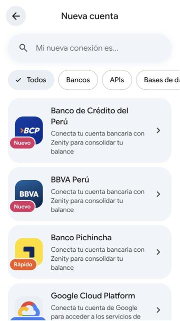

# Zenity

**Conecta tus finanzas en un solo lugar.** Prototipo front-end *mobile first* de Zenity, un consolidador financiero con asistente de IA. Toma como concepto las pantallas del [Figma de Zenity](https://www.figma.com/design/AhyL5qRK94EyUsUHlr1fjU/Zenity-App?node-id=26-2) y las lleva al lenguaje visual y de movimiento de [Gemini](https://gemini.google.com/app).

<p>
  
  
  
  
</p>
<p>
  
  
  
</p>

> Prototipo con datos de ejemplo: no hay backend, no se envían ni guardan datos y las respuestas de la IA son simuladas.

## Cómo correrlo

Requiere Node 20.19+ (o 22.12+).

```bash
npm install
npm run dev       # http://localhost:5173
npm run build     # typecheck + build de producción en dist/
npm run preview   # sirve el build
npm run lint      # oxlint
```

## Pantallas

| Figma | Ruta | Qué hace |
| --- | --- | --- |
| Splash | `/` | Bienvenida con destello animado, resplandor de fondo y CTA |
| Login (×2) | `/login` · `/login?modo=registro` | Correo con validación, Google/Apple (simulado) |
| Notifications | `/notificaciones` | Hoja inferior para activar notificaciones push |
| Home | `/inicio` | Saludo según la hora, ocultar saldos, periodo, carrusel de cuentas, ingresos/egresos/total, resumen de IA, reporte |
| Menu | menú lateral | Drawer en móvil, barra lateral fija en escritorio (como Gemini), tema oscuro/claro/sistema |
| Add new connection | `/conexiones/nueva` | Búsqueda, filtros y conexión animada a bancos, APIs, bases de datos y archivos |
| Conection added / error | `/conexiones/resultado` | Éxito o error con nube animada (*SQL Server* simula un error la primera vez) |
| Loading (×4) | `/analizando` | Análisis con IA en 4 pasos con progreso |
| No-categorized (×4) | `/revisar` | Detalle del movimiento, sugerencias de IA y "Enséñame cómo identificarlo" |
| Single account / Incomes / Expenses | `/movimientos/todo` · `/ingresos` · `/egresos` | Selector de cuenta, métricas, insights, categorías con transacciones y búsqueda |
| Resume | `/resumen` | Balance total y gráfico de barras interactivo por mes |
| Chat | `/chat` | Chat con Zenity: sugerencias, respuestas que se escriben en vivo, tablas, adjuntos y dictado por voz |
| Single conection / Empty data | `/conexion/:id` | Tarjeta con inclinación 3D, movimientos, estado vacío y eliminar conexión |

## Estilo Gemini aplicado

- **Tokens reales de Gemini** (`src/styles/tokens.css`): superficies `#131314` / `#1e1f20` / `#282a2c`, `primary #a8c7fa`, contenedores, contornos y sus equivalentes del tema claro.
- **Tipografía variable Google Sans Flex** (la de Gemini) con ejes de peso, ancho y redondez; iconos **Material Symbols Rounded** (equivalente público de Google Symbols) con transición de contorno a relleno.
- **Movimiento Material 3**: curvas `emphasized` y `decelerate`, transición de eje compartido al avanzar/volver (detecta el botón atrás del navegador) y *fade through* entre pestañas.
- **Efectos de IA**: saludo con degradado que barre el texto, texto con brillo ("Pensando…"), barras de carga azules, texto que aparece palabra por palabra, destello que gira mientras piensa, borde cónico giratorio en el campo de entrada y resplandor de fondo animado.
- **Detalles**: ripple y *state layers* de Material 3, montos con conteo animado, desenfoque al ocultar saldos, hojas inferiores que se cierran arrastrando, snackbars, diálogos e indicadores que se deslizan entre opciones.
- Respeta `prefers-reduced-motion` y funciona con teclado y lectores de pantalla.

## Cambios respecto al Figma

- Números de ejemplo consistentes: los totales se calculan desde las transacciones (en el Figma, por ejemplo, Ingresos 1,890.20 − Egresos 890.20 mostraba Total 890.20).
- Moneda unificada en soles (`S/`) y ortografía corregida («¿No tienes una cuenta?», «Regístrate», «¡Genial!», «¿Por dónde empezamos?»…). El texto «Carty» de las fuentes de conexión pasó a «Zenity».
- Se implementaron las notas del diseño: insights rápidos de **Ingresos** (fuente principal, cuenta con más ingresos, variación, cobros conciliados) y de **Egresos** (alerta, categoría dominante, cuenta con más salidas, operativo vs. comercial, devoluciones).
- Vista de escritorio con barra lateral y contenido en columnas.
- Los logos de los bancos son monogramas simplificados; los de Google, Excel, MySQL, SQL Server, PostgreSQL, XML, Visa y Mastercard vienen de los sets de iconos usados en el Figma (Iconify).

## Stack

[Vite 8](https://vite.dev) · React 19 · TypeScript · [React Router 8](https://reactrouter.com) (`HashRouter`) · [Motion](https://motion.dev) · CSS Modules · oxlint.

```
src/
  styles/      tokens, base, efectos y layout globales
  components/  UI reutilizable (botones, chips, hojas, tarjetas, gráfico, textos de IA…)
  layouts/     shell con navegación, transiciones entre pantallas, menú
  screens/     una pantalla por archivo
  data/        datos de ejemplo, selectores, insights y respuestas del chat
  state/       estado global (tema, saldos ocultos, periodo, conexiones, revisión)
  lib/         utilidades (formato, animaciones, ripple…)
```

## Despliegue

El workflow `.github/workflows/deploy.yml` compila y valida cada push y pull request. Si **GitHub Pages** está habilitado en el repositorio (*Settings → Pages → Source: GitHub Actions*), también publica la demo en cada push a `master`. El build usa rutas relativas y `HashRouter`, así que funciona desde cualquier subruta.
