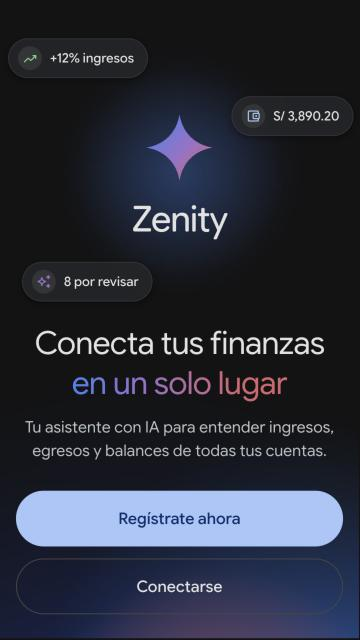
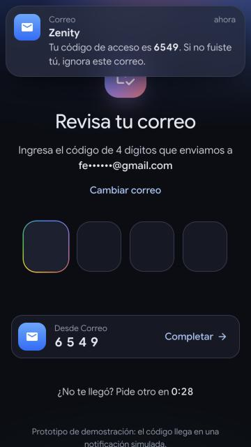
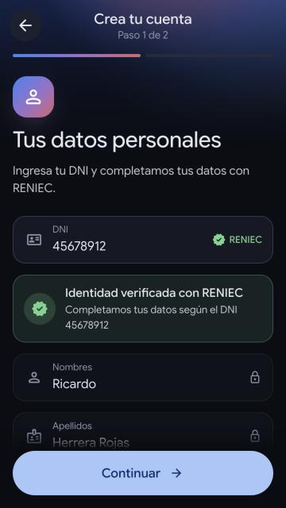
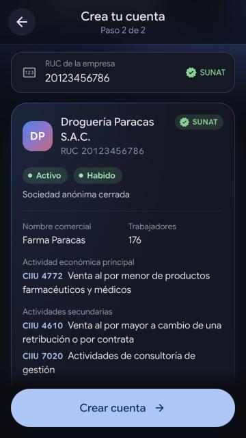
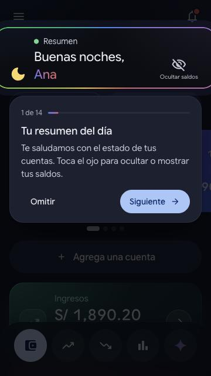
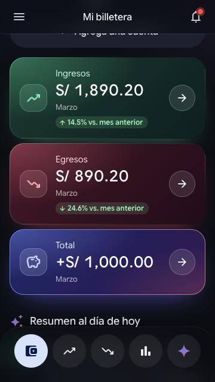
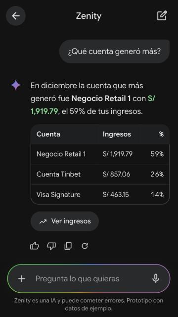
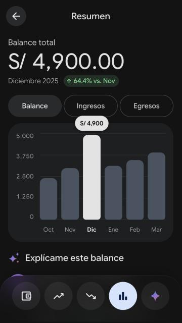
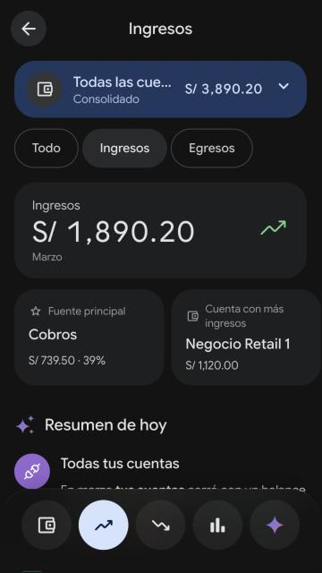
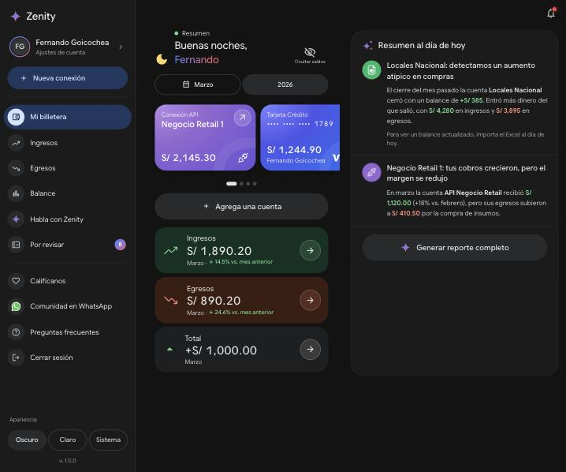

# Zenity

**Conecta tus finanzas en un solo lugar.** Prototipo front-end *mobile first* de Zenity, un consolidador financiero con asistente de IA. Toma como concepto las pantallas del [Figma de Zenity](https://www.figma.com/design/AhyL5qRK94EyUsUHlr1fjU/Zenity-App?node-id=26-2) y las lleva al lenguaje visual y de movimiento de [Gemini](https://gemini.google.com/app).

<p>
  
  
  
  
</p>
<p>
  
  
  
  
</p>
<p>
  
  
</p>

> Prototipo con datos de ejemplo: no hay backend, no se envían ni guardan datos y las respuestas de la IA son simuladas.

## Cómo correrlo

Requiere Node 20.19+ (o 22.12+).

```bash
npm install
npm run dev       # http://localhost:5173
npm run build     # typecheck + build de producción en dist/
npm run preview   # sirve el build
npm run lint      # oxlint
```

## Pantallas

| Figma | Ruta | Qué hace |
| --- | --- | --- |
| Splash | `/` | Bienvenida con destello animado, resplandor de fondo y CTA |
| Login (×2) | `/login` · `/login?modo=registro` | Correo con validación, Google/Apple (simulado). Al iniciar sesión con correo o con Google pide un código de verificación |
| — (nuevo) | `/verificacion` | Código OTP de 4 dígitos enviado al correo (inicio con correo) o por SMS (inicio con Google), con notificación simulada, autocompletado, 3 intentos y reenvío |
| — (nuevo) | `/registro/datos` | Registro paso 1: el DNI va primero; la consulta a RENIEC completa nombres, apellidos, fecha de nacimiento y dirección, y se agregan correo y celular (+51) |
| — (nuevo) | `/registro/empresa` | Registro paso 2: el RUC va primero (con dígito verificador); la consulta a SUNAT muestra la ficha de la empresa y completa razón social y nombre comercial; luego el ingreso mínimo mensual |
| Notifications | `/notificaciones` | Hoja inferior para activar notificaciones push |
| Home | `/inicio` | Saludo según la hora, ocultar saldos, periodo, carrusel de cuentas, ingresos/egresos/total, resumen de IA, reporte y **recorrido de bienvenida** en el primer ingreso |
| Menu | menú lateral | Drawer en móvil, barra lateral fija en escritorio (como Gemini), perfil y empresa registrados, "Ver tutorial" |
| Add new connection | `/conexiones/nueva` | Búsqueda, filtros y conexión animada a bancos, APIs, bases de datos y archivos |
| Conection added / error | `/conexiones/resultado` | Éxito o error con nube animada (*SQL Server* simula un error la primera vez) |
| Loading (×4) | `/analizando` | Análisis con IA en 4 pasos con progreso |
| No-categorized (×4) | `/revisar` | Detalle del movimiento, sugerencias de IA y "Enséñame cómo identificarlo" |
| Single account / Incomes / Expenses | `/movimientos/todo` · `/ingresos` · `/egresos` | Selector de cuenta, métricas, insights, categorías con transacciones y búsqueda |
| Resume | `/resumen` | Balance total y gráfico de barras interactivo por mes |
| Chat | `/chat` | Chat con Zenity: sugerencias, respuestas que se escriben en vivo, tablas, adjuntos y dictado por voz |
| Single conection / Empty data | `/conexion/:id` | Tarjeta con inclinación 3D, movimientos, estado vacío y eliminar conexión |

## Acceso, registro y onboarding

- **Verificación con código de 4 dígitos** al iniciar sesión con correo o con Google. El código "llega" como una notificación simulada (correo o SMS) y como sugerencia de autocompletado, igual que la del teclado del celular: al tocarla se escribe solo. Las casillas aceptan escribir, pegar y el autocompletado real del sistema (`autocomplete="one-time-code"`), verifican solas al completar los 4 dígitos y muestran los estados de verificando, error (con sacudida), éxito y bloqueo tras 3 intentos, con reenvío después de 30 segundos.
- **Registro en 2 pasos** después de "Regístrate", con campos *filled* de Material 3 (etiqueta flotante, brillo de Gemini al enfocar), validación en vivo y formato automático del celular y del monto. Los datos solo viven en memoria; la app guarda únicamente el nombre y la empresa para el saludo y el menú.
  - **Paso 1 · DNI → RENIEC**: al escribir los 8 dígitos se consulta RENIEC (barras de carga azules de Gemini) y se completan nombres, apellidos y fecha de nacimiento (bloqueados, con candado) y la dirección (editable). Faltan solo el correo y el celular.
  - **Paso 2 · RUC → SUNAT**: con el RUC completo y su dígito verificador válido se consulta SUNAT y aparece la ficha de la empresa: estado y condición, tipo de contribuyente, nombre comercial, trabajadores, actividad económica (CIIU) principal y secundarias, domicilio fiscal, fechas de inscripción e inicio de actividades, sistemas de emisión y contabilidad, comercio exterior y comprobantes electrónicos. Se completan la razón social (bloqueada) y el nombre comercial (editable).
  - **Consultas simuladas**: no hay conexión real con RENIEC ni SUNAT. Los datos se generan a partir del número (el mismo documento siempre devuelve la misma persona o empresa) con la forma de una respuesta real, en `src/data/registry.ts`, para cambiarlas luego por una API. Para probar: cualquier DNI de 8 dígitos; un DNI con todos los dígitos iguales o `12345678` no existe. RUC de ejemplo `20123456786`; un RUC 10 con tu DNI (`10` + DNI + dígito verificador) devuelve a la misma persona como "persona natural con negocio"; un RUC con los 8 dígitos centrales iguales (p. ej. `20111111112`) no existe.
- **Recorrido de bienvenida** en el primer ingreso: un foco animado con borde de degradado recorre cada sección del inicio (resumen, periodo, cuentas, agregar cuenta, ingresos/egresos/total, resumen con IA, reporte, notificaciones, menú) y cada opción de la barra inferior. Se puede repetir desde **Menú → Ver tutorial**.

## Paleta Midnight (solo modo oscuro)

El fondo gris neutro (`#131314`) con tiles verde y naranja al 18 % producía tonos oliva y marrón apagados, con poco contraste entre las tarjetas y el fondo. La propuesta actual:

- **Fondo** negro azulado `#0b0d13` con superficies de matiz índigo y una luz ambiental muy suave (azul, violeta y turquesa) detrás de todas las pantallas.
- **Ingresos**: degradado esmeralda con luz menta en la esquina, borde degradado y halo verde.
- **Egresos**: degradado rosa/borgoña (en lugar de marrón) con acento coral, más legible como alerta.
- **Total**: protagonista con el degradado de IA (azul → violeta → rosa) en el relleno y en el borde.
- Iconos en pastillas del color del acento, montos en blanco y variación vs. mes anterior en píldoras verde/roja según sea buena o mala.

## Estilo Gemini aplicado

- **Tokens de Gemini** (`src/styles/tokens.css`): roles de color (`primary #a8c7fa`, contenedores, contornos), formas y curvas de movimiento, sobre la paleta Midnight.
- **Tipografía variable Google Sans Flex** (la de Gemini) con ejes de peso, ancho y redondez; iconos **Material Symbols Rounded** (equivalente público de Google Symbols) con transición de contorno a relleno.
- **Movimiento Material 3**: curvas `emphasized` y `decelerate`, transición de eje compartido al avanzar/volver (detecta el botón atrás del navegador) y *fade through* entre pestañas.
- **Efectos de IA**: saludo con degradado que barre el texto, texto con brillo ("Pensando…"), barras de carga azules, texto que aparece palabra por palabra, destello que gira mientras piensa, borde cónico giratorio en el campo de entrada y resplandor de fondo animado.
- **Detalles**: ripple y *state layers* de Material 3, montos con conteo animado, desenfoque al ocultar saldos, hojas inferiores que se cierran arrastrando, snackbars, diálogos e indicadores que se deslizan entre opciones.
- Respeta `prefers-reduced-motion` y funciona con teclado y lectores de pantalla.

## Cambios respecto al Figma

- Números de ejemplo consistentes: los totales se calculan desde las transacciones (en el Figma, por ejemplo, Ingresos 1,890.20 − Egresos 890.20 mostraba Total 890.20).
- Moneda unificada en soles (`S/`) y ortografía corregida («¿No tienes una cuenta?», «Regístrate», «¡Genial!», «¿Por dónde empezamos?»…). El texto «Carty» de las fuentes de conexión pasó a «Zenity».
- Se implementaron las notas del diseño: insights rápidos de **Ingresos** (fuente principal, cuenta con más ingresos, variación, cobros conciliados) y de **Egresos** (alerta, categoría dominante, cuenta con más salidas, operativo vs. comercial, devoluciones).
- Vista de escritorio con barra lateral y contenido en columnas.
- Los logos de los bancos son monogramas simplificados; los de Google, Excel, MySQL, SQL Server, PostgreSQL, XML, Visa y Mastercard vienen de los sets de iconos usados en el Figma (Iconify).

## Stack

[Vite 8](https://vite.dev) · React 19 · TypeScript · [React Router 8](https://reactrouter.com) (`HashRouter`) · [Motion](https://motion.dev) · CSS Modules · oxlint.

```
src/
  styles/      tokens, base, efectos y layout globales
  components/  UI reutilizable (botones, chips, hojas, tarjetas, gráfico, textos de IA…)
  layouts/     shell con navegación, transiciones entre pantallas, menú
  screens/     una pantalla por archivo
  data/        datos de ejemplo, selectores, insights y respuestas del chat
  state/       estado global (perfil, saldos ocultos, periodo, conexiones, revisión, recorrido)
  lib/         utilidades (formato, animaciones, ripple…)
```

## Despliegue

El workflow `.github/workflows/deploy.yml` compila y valida cada push y pull request. Si **GitHub Pages** está habilitado en el repositorio (*Settings → Pages → Source: GitHub Actions*), también publica la demo en cada push a `master`. El build usa rutas relativas y `HashRouter`, así que funciona desde cualquier subruta.
